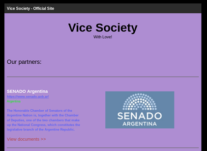
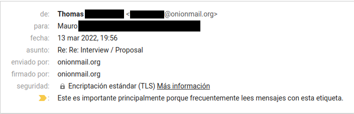

# (Español) Entrevista con el grupo de ransomware Vice Society

# Acerca de Vice Society

  

Vice Society es un grupo de ransomware que emergió a mediados de 2021 y ya cuenta con víctimas en más de una docena de países, incluyendo: Estados Unidos, Reino Unido, Arabia Saudita, Italia, Francia, Alemania, España, y hasta Argentina, donde atacaron nada más ni nada menos que al Senado. Por este último caso es que decidí entrevistarlos brevemente.

# Entrevista

  

Mi interlocutor es Thomas, líder de Vice Society.

**- ¿Cómo te decidiste a formar un grupo de ransomware? ¿Cómo nació Vice Society?**

_Por un grupo de amigos que estaban interesados en pentesting. Decidimos probar suerte._

**- Argentina se caracteriza por ser una víctima fácil y también por ser un mal pagador (Caso REvil, Everest). ¿Por qué los eligieron? ¿Fue a propósito?**

_[Encriptar] al gobierno de cualquier país es un logro y además, siempre tienen documentos interesantes. Tardamos 6 horas para obtener acceso a cada pieza de infraestructura crítica y alrededor de 6 horas más para atacar. Seguro te acordarás que su página web estuvo caída más de 1 semana a mediados de enero._

**- ¿Argentina intentó negociar o contactarlos? Si es así, ¿hicieron una oferta?**

_Hablamos con algunas organizaciones de Argentina en otras circunstancias pero no recordamos si pagaron._

**- Su lista de víctimas es bastante variada, pero esta es la segunda vez que listan una organización latinoamericana. ¿Cómo fue su experiencia? ¿Las organizaciones de LATAM suelen pagar o simplemente asumen la pérdida?**

_No es la segunda :), es la segunda que no pagó. Y sí, algunos de ellos pagan._

**- ¿Qué planes futuros tiene Vice Society? ¿Planean continuar operando contra infraestructura argentina o latinoamericana en general?**

_¡Seguro! ¿Por qué no? Amamos lo que hacemos, y no lo hacemos solo por el dinero._

**¿Qué es lo más especial de Vice Society? ¿Cuál fue su mejor momento o logro hasta ahora?**

_Los ataques contra Waikato y SPAR; y muchas otras empresas que pagaron (aunque no hablamos de los clientes que pagan)._

**Cuéntame un secreto, lo que quieras. No tiene que estar relacionado con Vice Society o con ciberseguridad.**

_No compartimos secretos =)._
  

# Conclusión

Vice Society ha llevado a cabo operaciones exitosas en Latinoamérica y particularmente en Argentina, donde distintas organizaciones han pagado rescates por su información y evitado ser expuestos públicamente. Esto contribuye a que dichos casos no puedan ser contabilizados a menos que, en una situación como la actual, uno de los involucrados en el incidente decida mencionarlo. 

Como es de esperarse, el grupo no habla de los clientes que ya han pagado por su información, y considera continuar sus operaciones en la región.

- [Mauro Eldritch](https://twitter.com/MauroEldritch)

---

# (English) Interview with Vice Society ransomware group

# About Vice Society

  

Vice Society is a ransomware group that emerged in mid-2021 and already has victims in more than a dozen countries, including: USA, UK, Saudi Arabia, Italy, France, Germany, Spain, and even Argentina, where they attacked the Senate. Following this last case is that I decided to interview them briefly.

# Interview

  

I talk to Thomas, leader of Vice Society.

**How did you decide to team up and start a dedicated ransomware group? How was Vice Society born?**

_Group of friends that was interested in pentest. We decided to try._

**Argentina is well-known for beign an easy victim and also a bad payer (as with REvil and Everest groups). Why target them? Was it on purpose?**

_Government of any country is achievement and they always have interesting documents. We've spent 6 hours to get access to every critical IT structure and about 6 hours to attack. Maybe you remember that their website was offline more then 1 week in mid January._

**Did Argentina even bothered on negotiating or contacting you? If so, did they make an offer?**

_We talked with some organizations from Argentina but we can't remember if they paid._

**Your portfolio is pretty varied  but this is the second time you target a latinoamerican asset. How was your experience? Do LATAM orgs pay or do they just let it slip away?**

_It is not second ) it is second that did not paid. And yes, some of them pay._

**What's in the future for Vice Society? Do you plan on further targeting Argentine or general LATAM infrastructure?**

_Sure, why not? We love what we do, and we don't do everything just for money._

**What's the most special thing about Vice Society? What was your proudest moment/value/achievement until now?**

_Waikato\SPAR many other companies that paid (we don't talk about who paid us)._

**Tell me a secret, anything you like. Doesn't have to be related to Vice Society or Security at all.**

_We don't share secrets =)._

# Conclusion

Vice Society has carried out successful operations in Latin America and particularly in Argentina, where different organizations have paid ransoms for their information and avoided being publicly exposed. This contributes to the fact that these cases cannot be accounted for unless, in a situation like the current one, one of those involved in the incident decides to come clear about it.

As expected, the group does not mention clients who have already paid for their information, and considers continuing its operations in the region.

- [Mauro Eldritch](https://twitter.com/MauroEldritch)